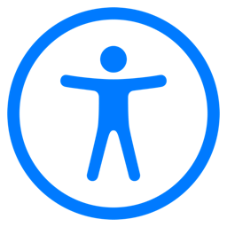

.. _overview:

========
Overview
========

Introduction
------------

1-3 paragraphs: Present the promise/ obstacle/ solution for your project— What is the problem you are solving and why is it important to solve it?

Related Work
------------

Related Work– 1-3 paragraphs: Talk about relevant work that closely connects with your project.

Methodology
-----------

Methodology– about 3 paragraphs: What did you do in your project- what did you design or implement? What role did people with disabilities play in this, if any

Disability Justice Perspective
------------------------------

Disability Justice Perspective– 1 paragraph: How did a disability studies perspective inform your project?

Learnings and Future Work
-------------------------

Learnings and future work – 1-2 paragraphs: Describe what you learned and how this can be extended/ built on in the future.

How you Made your App Accessible
--------------------------------

How you made your app accessible – 1-2 paragrphs and (optionally) UARS you found in an appendix
